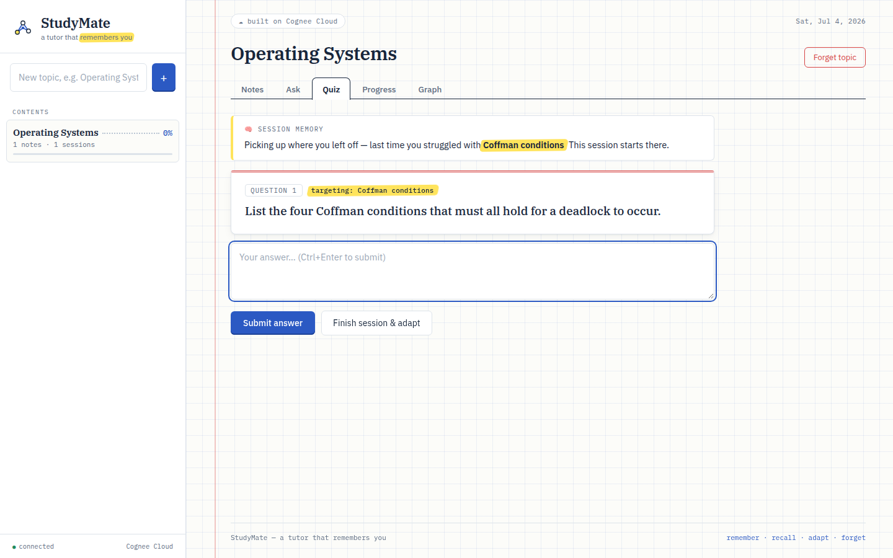
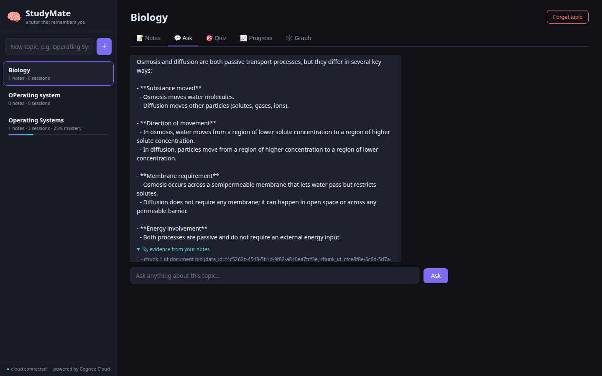
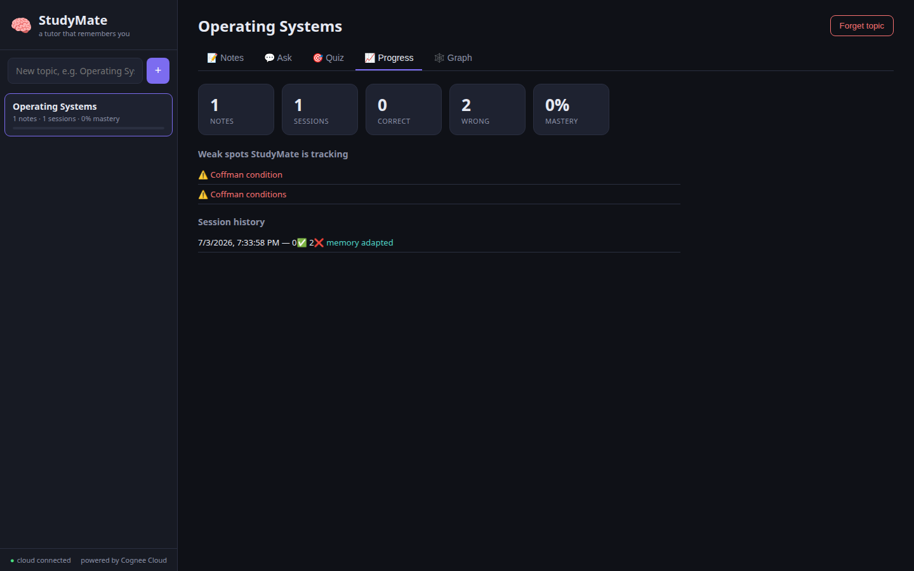
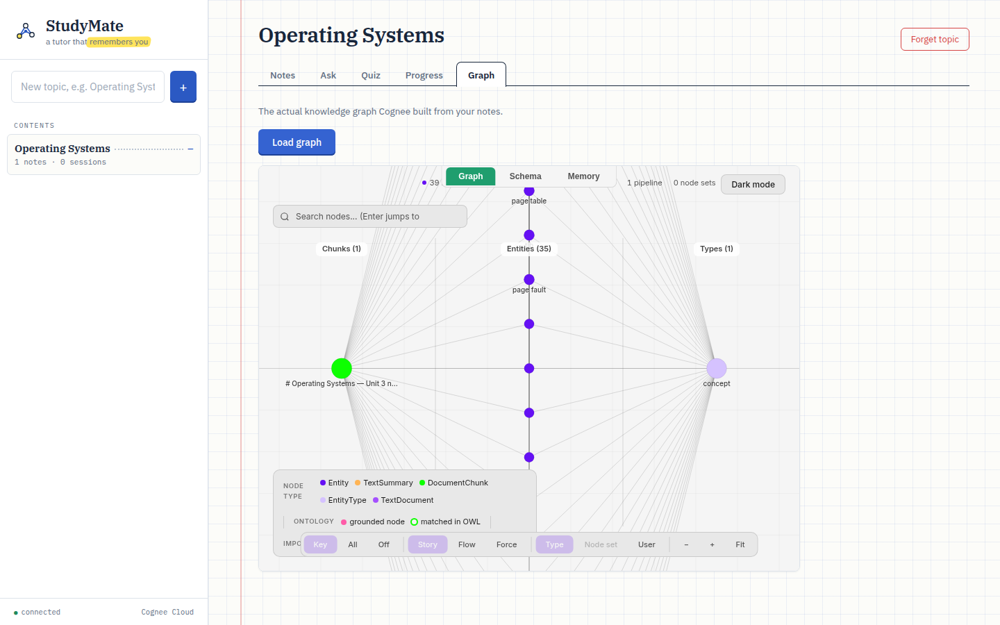

# 🧠 StudyMate — a tutor that remembers you

Every AI tutor forgets you the moment you close the tab. StudyMate doesn't.

Built on **[Cognee Cloud](https://www.cognee.ai/)** for the WeMakeDevs × Cognee
hackathon *"The Hangover Part AI: Where's My Context?"* — **Best Build on Cognee
Cloud** track.



## The problem

Students already use AI to study — but every session starts from zero. The AI
doesn't know what you got wrong yesterday, which concepts keep tripping you up,
or what you've already mastered. It tutors *a* student, never *you*.

## What StudyMate does

Feed it your own study notes (paste text or upload PDF/Markdown/TXT/CSV/JSON).
It builds a knowledge graph of what *you* are learning, then tutors you against
it — and it remembers every session:

- **📝 Notes** — your material becomes permanent graph memory, one dataset per
  topic.
- **💬 Ask** — answers grounded in *your* notes, with a collapsible
  **evidence trail citing the exact note chunks** each answer came from.
  Follow-up questions work: the chat is session-aware, so "how is it different
  from the other process I asked about?" just works.
- **🎯 Quiz** — questions are generated from your notes and graded against
  them. Every answer is recorded as scored feedback in session memory. The next
  session doesn't start from zero: it **opens by targeting the concepts you got
  wrong last time**, and concepts drop off the weak list when you master them.
- **📈 Progress** — mastery per topic, tracked weak spots, session history.
- **🕸️ Graph** — the actual knowledge graph Cognee built from your notes,
  fully interactive.
- **🗑️ Forget** — wipe a topic completely and re-learn it fresh.

| Ask with evidence | Progress & weak spots | Your knowledge graph |
|---|---|---|
|  |  |  |

## How it uses the Cognee memory lifecycle

| StudyMate feature | Cognee Cloud API |
|---|---|
| Ingest notes / files into a topic | `remember(text_or_file, dataset_name=topic)` — one dataset per topic |
| Grounded Q&A | `recall(query, datasets=[topic], system_prompt=…)` |
| Evidence trail in answers | `recall(…, include_references=True)` — deterministic citations to note chunks |
| Conversational follow-ups | `recall(…, session_id=chat_session)` — session-aware retrieval |
| Generate & grade quiz questions | `recall()` with task-specific `system_prompt`s (server-side LLM — no separate LLM key) |
| Record every quiz answer | `remember(QAEntry(feedback_score=1..5), session_id=quiz_session)` — session memory |
| Adapt to your weak spots | Cognee Cloud bridges session feedback into the permanent graph automatically; verified via `GET /api/v1/sessions/{id}` |
| Prove the memory is real | Finishing a session renders a **memory receipt** — every graded answer read back live from the sessions API, with its cloud `qa_id` and feedback score |
| Visualize your knowledge | `GET /api/v1/visualize?dataset_id=…` embedded in the app |
| Wipe a topic | `forget(dataset=topic)` |

The adaptive loop is the point: wrong answers become low-score `QAEntry`
feedback in session memory; Cognee Cloud bridges that feedback into the
permanent graph in the background; the next quiz session is steered toward
exactly the concepts you struggle with — and lets go of them once you answer
correctly. And it's not just asserted: ending a session reads your answers
back **from the cloud** and shows the receipt, cloud IDs and all.

## Architecture

```
frontend (vanilla JS, zero deps)
        │  REST
        ▼
FastAPI backend
   ├── memory.py  ── Cognee Python SDK (serve → cloud) + Cloud REST
   │                  remember · recall · forget · sessions · visualize
   └── store.py   ── tiny local JSON bookkeeping (scores, weak concepts)
        │
        ▼
Cognee Cloud  (knowledge graphs, session memory, feedback bridging, LLM)
```

All memory lives in Cognee Cloud. The local store only keeps instant-read UI
stats (scores, session list, weak-concept names).

## Running it

```bash
python3 -m venv .venv
.venv/bin/pip install -r requirements.txt

cp .env.example .env   # add your Cognee Cloud tenant URL + API key

.venv/bin/uvicorn main:app --app-dir backend --port 8300
```

Open http://localhost:8300 — create a topic, add notes (try
`demo/operating-systems.md`), and start studying.

### Deploying

A `Dockerfile` and `render.yaml` are included — connect the repo on
[Render](https://render.com) (or any Docker host), set `COGNEE_BASE_URL` and
`COGNEE_API_KEY`, and it's live. `STUDYMATE_MAX_TOPICS` caps topic count on a
shared demo instance.

## Testing

Two harnesses, both run against the real Cognee Cloud:

```bash
# API smoke test — the full memory lifecycle end to end
.venv/bin/python scripts/smoke.py

# Browser end-to-end test — drives the whole UI in headless Chrome
.venv/bin/pip install playwright
.venv/bin/python scripts/ui_test.py
```

The UI test covers topic creation, ingestion, grounded Q&A with evidence, quiz
grading, the **live cloud memory receipt**, **adaptive targeting on a second
session**, progress, graph, and forget — 15 checks.

## Stack

FastAPI · Cognee Cloud (Python SDK + REST) · vanilla JS, zero frontend
dependencies.

## License

MIT — see [LICENSE](LICENSE).
