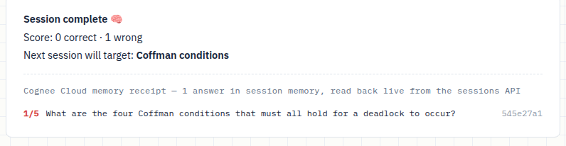

# 🧠 StudyMate — a tutor that remembers you

Every AI tutor forgets you the moment you close the tab. StudyMate doesn't.

Built on **[Cognee Cloud](https://www.cognee.ai/)** for the WeMakeDevs × Cognee
hackathon *"The Hangover Part AI: Where's My Context?"* — **Best Build on Cognee
Cloud** track.

**▶️ 3-minute demo:** https://youtu.be/pAkjaWQW7d4

**🔴 Try it live:** https://zshops-slight-list-cons.trycloudflare.com — already
loaded with an Operating Systems topic that has a weak spot on record. Open
**Quiz → Start quiz session** and watch it remember. *(If the link is down,
the 3-minute local setup below gets you the same thing.)*


## The problem

Students already use AI to study — but every session starts from zero. The AI
doesn't know what you got wrong yesterday, which concepts keep tripping you up,
or what you've already mastered. It tutors *a* student, never *you*.

## What StudyMate does

Feed it your own study notes (paste text or upload PDF/Markdown/TXT/CSV/JSON).
It builds a knowledge graph of what *you* are learning, then tutors you against
it — and it remembers every session:

- **📝 Notes** — your material becomes permanent graph memory, one dataset per
  topic.
- **💬 Ask** — answers grounded in *your* notes, with a collapsible
  **evidence trail citing the exact note chunks** each answer came from.
  Follow-up questions work: the chat is session-aware, so "how is it different
  from the other process I asked about?" just works.
- **🎯 Quiz** — questions are generated from your notes and graded against
  them. Every answer is recorded as scored feedback in session memory. The next
  session doesn't start from zero: it **opens by targeting the concepts you got
  wrong last time**, and concepts drop off the weak list when you master them.
- **📈 Progress** — mastery per topic, tracked weak spots, session history.
- **🕸️ Graph** — the actual knowledge graph Cognee built from your notes,
  fully interactive.
- **🗑️ Forget** — wipe a topic completely and re-learn it fresh.

| Ask with evidence | Progress & weak spots | Your knowledge graph |
|---|---|---|
|  |  |  |

## How it uses the Cognee memory lifecycle

| StudyMate feature | Cognee Cloud API |
|---|---|
| Ingest notes / files into a topic | `remember(text_or_file, dataset_name=topic)` — one dataset per topic |
| Grounded Q&A | `recall(query, datasets=[topic], system_prompt=…)` |
| Evidence trail in answers | `recall(…, include_references=True)` — deterministic citations to note chunks |
| Conversational follow-ups | `recall(…, session_id=chat_session)` — session-aware retrieval |
| Generate & grade quiz questions | `recall()` with task-specific `system_prompt`s (server-side LLM — no separate LLM key) |
| Record every quiz answer | `remember(QAEntry(feedback_score=1..5), session_id=quiz_session)` — session memory |
| Adapt to your weak spots | Cognee Cloud bridges session feedback into the permanent graph automatically; verified via `GET /api/v1/sessions/{id}` |
| Prove the memory is real | Finishing a session renders a **memory receipt** — every graded answer read back live from the sessions API, with its cloud `qa_id` and feedback score |
| Visualize your knowledge | `GET /api/v1/visualize?dataset_id=…` embedded in the app |
| Wipe a topic | `forget(dataset=topic)` |

The adaptive loop is the point: wrong answers become low-score `QAEntry`
feedback in session memory; Cognee Cloud bridges that feedback into the
permanent graph in the background; the next quiz session is steered toward
exactly the concepts you struggle with — and lets go of them once you answer
correctly. And it's not just asserted: ending a session reads your answers
back **from the cloud** and shows the receipt, cloud IDs and all.



### Where each Cognee call lives in the code

Every memory operation goes through one file:
[`backend/memory.py`](backend/memory.py) (~250 lines, written to be read).

| Function in `memory.py` | Cognee call it makes |
|---|---|
| `connect()` | `cognee.serve(url, api_key)` — routes the whole SDK to Cognee Cloud |
| `ingest_notes()` / `ingest_file()` | `cognee.remember(text_or_file, dataset_name=…)` — builds the topic's knowledge graph |
| `ask()` → `_recall_text()` | `cognee.recall(query, datasets=[…], top_k=10, system_prompt=…, session_id=…, include_references=True)` |
| `quiz_question()` / `grade_answer()` | `cognee.recall()` with task-specific system prompts — generation and grading are grounded in the same graph |
| `record_qa()` | `cognee.remember(cognee.QAEntry(feedback_score=5 or 1), session_id=…)` — scored session memory |
| `adapt()` | `GET /api/v1/sessions/{id}` — reads the session's QA feedback back from the cloud (the UI's memory receipt) |
| `wipe()` | `cognee.forget(dataset=…)` |
| `graph_html()` | `GET /api/v1/visualize?dataset_id=…` — the interactive graph in the Graph tab |

StudyMate is built on the **new Cognee 1.0 memory lifecycle —
`remember` / `recall` / `forget` plus session memory and `QAEntry` feedback
bridging — not the older add/cognify/search flow.** That means it exercises the
write-and-adapt path, not just read-only ingest-and-query.

The graph architecture in one paragraph: **each topic is its own Cognee
dataset**, so its notes become an isolated knowledge graph (entities +
relationships extracted by Cognee from your material). **Each quiz is a Cognee
session**: every graded answer is written into it as a `QAEntry` whose
`feedback_score` (1 = missed, 5 = mastered) is exactly the signal Cognee Cloud
bridges back into the permanent graph. Retrieval for questions, grading, and
chat all `recall()` against that same graph — one memory, read and written
from every feature.

## Architecture

```
frontend (vanilla JS, zero deps)
        │  REST
        ▼
FastAPI backend
   ├── memory.py  ── Cognee Python SDK (serve → cloud) + Cloud REST
   │                  remember · recall · forget · sessions · visualize
   └── store.py   ── tiny local JSON bookkeeping (scores, weak concepts)
        │
        ▼
Cognee Cloud  (knowledge graphs, session memory, feedback bridging, LLM)
```

All memory lives in Cognee Cloud. The local store only keeps instant-read UI
stats (scores, session list, weak-concept names).

## Running it locally

```bash
python3 -m venv .venv
.venv/bin/pip install -r requirements.txt

cp .env.example .env   # add your Cognee Cloud tenant URL + API key

.venv/bin/uvicorn main:app --app-dir backend --port 8300
```

Open http://localhost:8300. The green dot bottom-left of the sidebar confirms
the app is connected to Cognee Cloud.

## How to use it — the 3-minute tour

This is the exact flow that shows the memory working. Cloud graph-building and
grading take real time (noted per step) — the animated dots mean Cognee is
working.

1. **Create a topic** — type a name in the sidebar (e.g. *Operating Systems*)
   and press <kbd>+</kbd>.
2. **Feed it your notes** — paste text into the Notes tab, or click *Upload
   file* (PDF/MD/TXT/CSV/JSON). Try the included
   [`demo/operating-systems.md`](demo/operating-systems.md). *(~30 s: your
   notes are becoming a knowledge graph.)*
3. **See the graph** — open the **Graph** tab; it draws itself. Every node was
   extracted from what you pasted.
4. **Ask something** — in **Ask**, try *"What are the four conditions required
   for deadlock?"* Expand **📎 evidence from your notes** under the answer to
   see the exact note chunks it was grounded in. Follow-ups work — the chat
   remembers the session.
5. **Take a quiz — and get something wrong on purpose** — in **Quiz**, start a
   session and flub an answer (*"no idea"*). You'll see the correction
   *(grading takes ~20–30 s)*. Answer one more, then click **Finish session &
   adapt** — the summary shows the **memory receipt**: your graded answers
   read back live from Cognee Cloud, weak answers scored 1/5.
6. **Start a second session — the payoff** — the quiz opens with a
   **🧠 session memory** note: *"last time you struggled with X — this session
   starts there"*, and the first question attacks exactly that concept. Answer
   it correctly this time, finish, and the concept drops off your weak list.
   Check **Progress** to watch the weak-spot list shrink.
7. **Forget** — the *Forget topic* button erases the topic's graph from Cognee
   permanently.

### Deploying (optional)

A `Dockerfile` and `render.yaml` are included — connect the repo on
[Render](https://render.com) (or any Docker host), set `COGNEE_BASE_URL` and
`COGNEE_API_KEY`, and it's live. `STUDYMATE_MAX_TOPICS` caps topic count and
`STUDYMATE_SEED=1` pre-loads a demo topic on a shared instance.

## Testing

Two harnesses, both run against the real Cognee Cloud:

```bash
# API smoke test — the full memory lifecycle end to end
.venv/bin/python scripts/smoke.py

# Browser end-to-end test — drives the whole UI in headless Chrome
.venv/bin/pip install playwright
.venv/bin/python scripts/ui_test.py
```

The UI test covers topic creation, ingestion, grounded Q&A with evidence, quiz
grading, the **live cloud memory receipt**, **adaptive targeting on a second
session**, progress, graph, and forget — 16 checks.

## Stack

FastAPI · Cognee Cloud (Python SDK + REST) · vanilla JS, zero frontend
dependencies.

## License

MIT — see [LICENSE](LICENSE).
